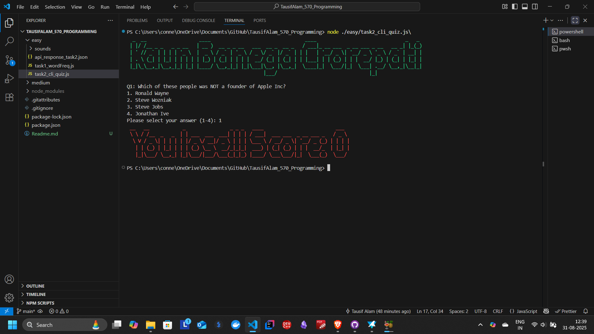
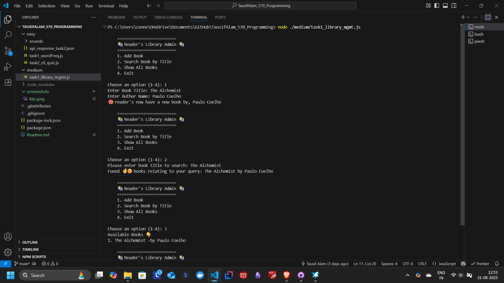
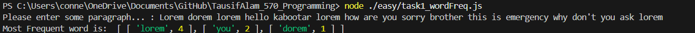

## Submissions for ACE - Programming Domain

| Tasks Done | Level | Description |
| ----------- | ----------- | ----------- |
| Word Frequency | Easy | used RegEx for the first time |
| CLI Quiz | Easy | Personal Favourite, KBC feel |
| Library Management | Medium | Learnt Classes |

---
### CLI Quiz

1. with KBC sfx
2. Checkout live video preview here (old version): [Streamable](https://streamable.com/64pr5a) 

### Library Management

### Word Frequency (Top 3)

> end of submssion, please go through source codes, 😊🤞 join me in your troop 🧑‍💻😭

### By Tausif Alam, Rank 570, BCA 1EA 2025-28
